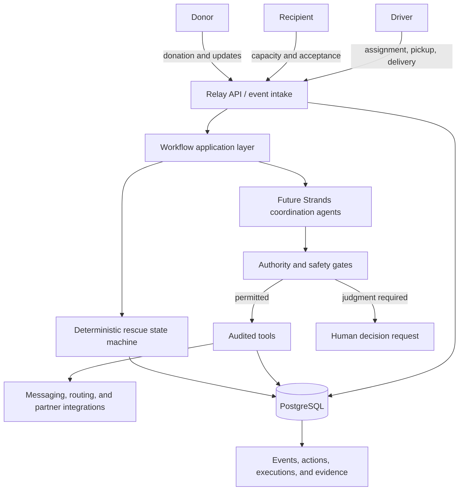

# Relay architecture

## Purpose

Relay is an autonomous coordination layer for food rescue. Its architecture supports a continuous
operating loop:

```text
OBSERVE -> REASON -> ACT -> VERIFY -> RECOVER -> ESCALATE ONLY WHEN NECESSARY
```

The central design constraint is that probabilistic reasoning may help coordinate work, but it must
not become the source of truth for rescue state, authorization, food-handling requirements, or
business rules.

## System context



Strands Agents and external integrations are architectural seams in Phase 1. They are not yet
implemented or presented as deployed functionality.

## Component boundaries

### Domain

`app/domain` contains immutable Pydantic models and enums for organizations, participants,
donations, rescues, allocations, assignments, evidence, events, exceptions, decisions,
notifications, receipts, and audit records. It imports neither FastAPI nor SQLAlchemy. These types
express the language and invariants of food-rescue coordination without binding them to transport,
persistence, or an agent framework.

### Deterministic services

`app/services` owns rules that must produce repeatable outcomes from explicit inputs:

- The rescue state machine contains every allowed lifecycle transition. Invalid transitions raise a
  typed error and terminal states have no outgoing edges.
- The policy evaluator classifies proposed actions as green, amber, or red. Amber actions require an
  explicit active policy grant. Red actions cannot be enabled by an agent-supplied instruction.
- The food-safety gate evaluates verified evidence, elapsed-time limits, storage constraints, and
  policy conflicts. Missing or conflicting requirements fail closed.

These services remain callable without a model, network connection, or database.

### API and application workflow

`app/api` handles HTTP translation. `app/workflows` will coordinate use cases and transactions in a
later phase. API handlers must not embed domain rules. Workflows will ask deterministic services to
authorize actions and transitions, then persist the resulting event and audit records atomically.

### Agent reasoning

Future code in `app/agents` may:

- Extract structured operational facts from unstructured messages
- Classify incoming text and identify missing information
- Propose recovery or coordination plans
- Compose clear communications for participants
- Rank options that have already passed deterministic eligibility filters

An agent proposal is untrusted input. Before execution, it must pass schema validation, policy
authorization, safety checks, and lifecycle validation. Agents do not write directly to persistence
or call integrations outside audited tool wrappers.

### Tools and integrations

Future `app/tools` functions form the action boundary. Each invocation will receive an authorized,
typed request and produce an auditable result. `app/integrations` contains vendor-specific adapters
for messaging, maps, or partner systems. Tool wrappers will record action and execution summaries,
authority, policy references, trace IDs, outcomes, and safe error metadata.

### Persistence

`app/models` contains SQLAlchemy records and `app/repositories` owns persistence access. PostgreSQL
is the production database. Async SQLAlchemy isolates database lifecycle from domain objects.
Alembic owns schema changes.

The first migration intentionally creates only stable foundations: organizations, rescues, events,
and agent actions. Other domain primitives are defined now but remain outside the relational schema
until their transactional behavior is designed. This avoids locking unstable workflows into dozens
of premature tables.

## Ownership of truth

Deterministic systems own:

- Rescue lifecycle state and valid transitions
- Action authorization and policy applicability
- Required evidence and its verification status
- Time-window and storage-constraint calculations
- Recipient and driver eligibility rules
- Idempotency and transaction boundaries
- Whether the system is permitted to continue

Future Strands agents own:

- Interpretation of unstructured input
- Operational exception analysis
- Coordination-plan proposals
- Participant communication
- Selecting among options already proven eligible

Humans own ambiguous or consequential decisions, including policy conflicts, insufficient critical
evidence, unclear handling requirements, potentially unsafe conditions, and high-impact overrides.

## Event and audit model

Events have unique IDs, rescue IDs, typed event names, actor identity, UTC timestamps, structured
payloads, mandatory idempotency keys, and trace IDs. A database uniqueness constraint protects the
idempotency key at the persistence boundary.

Agent actions and tool executions capture operational summaries rather than hidden reasoning. Audit
records include the agent and tool names, authority level, policy reference, trace ID, timestamp,
success state, and structured error metadata. Pydantic models reject undeclared fields, which helps
prevent accidental persistence of chain-of-thought content.

## Runtime foundation

- Python 3.12 with dependencies locked by uv
- FastAPI with `/health` and an extensible `/ready` response
- Typed environment settings with the `RELAY_` prefix
- Request IDs accepted through `X-Request-ID` or generated per request
- Structured JSON application and request logging
- CORS origins supplied through configuration
- SQLAlchemy 2 async engine and sessions
- Alembic migrations targeting PostgreSQL, with SQLite permitted for isolated tests only
- Ruff, mypy strict mode, pytest, and matching GitHub Actions gates

## Future transaction rule

When workflows arrive, one database transaction should persist the accepted input event, validated
state transition, business change, and audit record. External side effects require an outbox or an
equivalent durable delivery pattern before production use. Phase 1 deliberately does not introduce
an event bus or distributed-service boundary.
