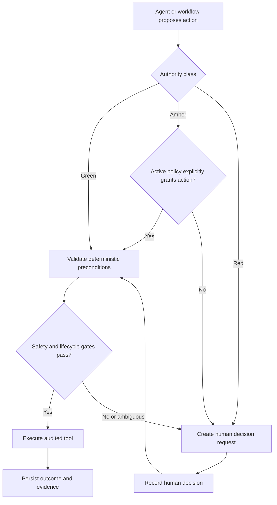

# Autonomy and safety

## Governing rule

Relay may coordinate operations autonomously only inside explicit, deterministic authority. It must
escalate when evidence, policy, or safety is ambiguous. An LLM must never decide that food is safe
to eat and must never override a failed safety or authorization gate.

## Action authority

Every proposed action is classified before execution.

### Green: routine autonomy

Relay may execute green actions without asking a person when their normal preconditions pass:

- Search for an alternate eligible recipient after a decline or capacity change
- Search for a replacement after a driver declines or cancels
- Send operational status updates
- Request missing, non-sensitive operational information

Green does not bypass other rules. For example, an alternate-recipient search may return only
recipients that deterministic eligibility and handling constraints permit.

### Amber: explicit policy authority

Relay may execute amber actions only when an active, applicable policy explicitly lists that action:

- Substitute a recipient
- Split a rescue or allocation
- Extend a pickup window
- Change an assigned driver
- Request clarification through a configured channel

No policy, inactive policy, or missing grant means the action is denied and requires human review.
Agent interpretation cannot create an implicit grant.

### Red: human judgment

Relay never executes red actions autonomously:

- Override a handling requirement
- Continue despite missing critical evidence
- Resolve conflicting policy rules
- Override recipient or driver eligibility
- Continue after a potentially unsafe condition
- Apply a high-impact manual override

Even a policy that appears to request one of these actions cannot authorize it through the standard
autonomy evaluator. A human decision must be collected and audited through a separate workflow.

## Food-handling boundary

The future LLM may extract facts such as a reported temperature, recognize that a driver mentioned a
delay, or identify that an image is missing. Extracted facts are claims until validated by the
appropriate deterministic or human process.

Deterministic code must:

- Load the applicable handling rules
- Validate that all required evidence types are present and verified
- Calculate elapsed time using timezone-aware timestamps
- Compare the configured storage category and other explicit constraints
- Detect unresolved policy conflicts
- Return whether the workflow is allowed to continue

The initial `FoodSafetyGate` fails closed when verified evidence is missing, elapsed time exceeds a
configured maximum, the storage category differs, or policies conflict. A failed result includes
structured requirement codes and requests human review; it does not claim that food is unsafe or
safe. Food-safety professionals and participating organizations remain responsible for defining the
actual policies used in production.

## Decision flow

A human approval does not silently rewrite a rule. The later workflow must record who decided, what
request they answered, their stated rationale, the evidence available, and the resulting authorized
operation.

## Audit data

Relay persists safe operational reasoning summaries, such as “recipient declined; searching two
eligible alternatives,” and structured evidence used by deterministic rules. It does not persist
chain-of-thought, hidden model reasoning, or raw secrets.

Each future autonomous action and tool call must be attributable through:

- Action or execution ID and rescue ID
- Agent and tool names
- Input and result summaries
- Authority level and policy or rule reference
- Trace ID and UTC timestamp
- Success or failure and safe structured error metadata

Incoming events also require an idempotency key so retries cannot silently duplicate an operational
change.

## Failure behavior

Invalid lifecycle transitions raise a typed error without changing state. Unknown action types are
not assigned a permissive default. Missing amber authorization is denied. Red actions always require
a person. Safety inputs that are missing, unverified, contradictory, expired, or outside configured
constraints stop autonomous progress and produce an escalation signal.

These rules are implemented without an LLM and tested without network access.

## Phase 2 execution boundary

`AuthorizedActionService` now applies this model before any application-owned tool runs. It writes a
safe audit record for permitted, denied, escalated, and failed attempts. Permitted tool mutations and
their success records share one unit of work. A tool failure rolls back its mutations before Relay
writes a separate failure audit containing only an operational code and exception type.

Green records correctly carry no policy reference unless a policy actually authorized the action.
Successful amber records retain the active policy reference. Denied amber and red attempts preserve
an applicable policy reference while preventing tool execution.
