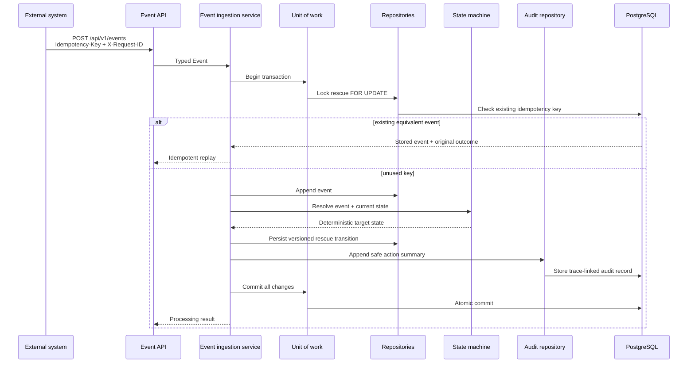

# Transactional event processing

Relay builds the deterministic execution layer before adding Strands agents because a model must not
own business truth. Future agents may propose coordination actions, but this layer validates every
input, locks mutable state, chooses the legal transition, records evidence, and commits atomically.

## Processing sequence

## Repository boundary

Application services depend on typed repository protocols for rescues, events, organizations, agent
actions, and tool executions. SQLAlchemy sessions remain inside repository and unit-of-work code.
Domain objects are mapped explicitly to persistence records, so database models do not become the
domain model.

## Transaction guarantee

One unit of work covers event acceptance, idempotency validation, rescue locking and transition,
processing-outcome persistence, and action audit creation. Exiting without `commit()` rolls back.
Exceptions roll back automatically. If the audit write fails after an event and transition have been
flushed, neither the event nor state change is committed.

Authorized tools use the same rule. Successful mutations, agent actions, and tool executions commit
together. If a tool fails, its mutation transaction is rolled back, then a separate safe failure
record is written without hidden prompts, secrets, or chain-of-thought.

## Idempotency

Every event requires a validated idempotency key. Processing first checks for a stored event after
locking the rescue. Equivalent retries return the original event identifier and stored before/after
outcome with `idempotent_replay=true`; they create no new transition, event, action, or tool side
effect. Reusing a key with a different rescue, event type, actor, or payload returns a conflict.

The unique database constraint on `events.idempotency_key` remains the race-safe final guard. If two
transactions pass an early lookup, the losing uniqueness race rolls back and resolves the committed
event as a replay or a conflict.

## Concurrency

Event processing uses a PostgreSQL `SELECT ... FOR UPDATE` lock for rescue mutation. Concurrent
events for one rescue therefore observe committed state in sequence. A second event that is no
longer legal fails with an event-state conflict rather than silently overwriting the first result.

The rescue mapper also configures SQLAlchemy optimistic versioning through `version_id_col`. Every
update includes the previously observed version in its predicate and increments the version. A stale
writer raises `ConcurrentModification` when zero rows match. Row locking protects the primary event
path; optimistic versioning protects other repository callers and future workflows.

## Deterministic routing

Event payloads are evidence, not commands. A payload field such as `target_status=completed` cannot
select a lifecycle state. The registry maps each supported event and current state to one target, and
the state machine validates that transition again.

Phase 2 supports:

- Donation creation and rescue initialization
- Recipient acceptance and decline
- Driver acceptance and cancellation
- Pickup confirmation
- Delivery confirmation and mismatch
- Human decisions received during human review

Known event types without a Phase 2 handler return `unsupported_event`. Supported events received in
the wrong lifecycle state return `event_state_conflict` and roll back.

## Trace propagation

The API validates `X-Request-ID` as 1–100 characters from a restricted character set. If absent, it
generates a UUID. The same value flows through the event, processing result, agent-action audit, and
future tool-execution audit. Invalid or oversized values are rejected before application processing.

## PostgreSQL as production truth

Fast unit and API tests may use SQLite, but PostgreSQL tests cover semantics that SQLite cannot prove:
native UUID and JSONB storage, timezone-aware timestamps, foreign keys, uniqueness races, row locks,
optimistic concurrency, and transactional rollback. Local development uses the pinned PostgreSQL
image in `compose.yml`; CI uses the same image as a service container and applies all Alembic
migrations before running integration tests.
