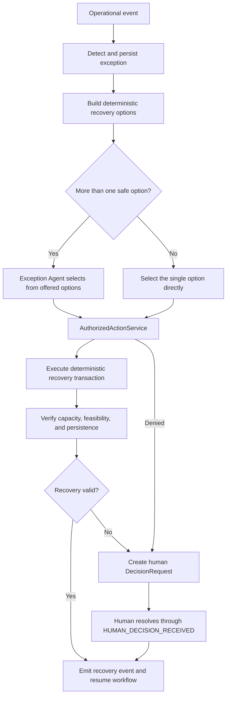

# Matching and recovery

Phase 4 adds Relay's deterministic rescue engine. Language models cannot decide eligibility,
quantities, capacity, routes, driver feasibility, authorization, food handling, or lifecycle state.
The Exception Agent may select one strategy only when deterministic code presents more than one
permitted option. Every mutation still crosses `AuthorizedActionService` and the state machine.

## Rescue network and eligibility

The persisted network contains explicitly synthetic demo donors, recipients, and drivers. Recipient
eligibility checks active status, accepted food category, remaining capacity, cold storage, dietary
capabilities, service radius, daily hours, and active policy. The result includes all blocking
reasons, warnings, category matches, capacity and storage evidence, and the policy reference.

The engine evaluates each food item independently. A recipient must pass every required check before
it can be scored as eligible. Ineligible recipients remain in `MatchPlan` with their rejection
evidence so a coordinator can audit the outcome.

## Route and feasibility model

`RouteProvider` separates deterministic matching from future routing integrations.
`StaticRouteProvider` uses a fixed matrix for the demo network and a deterministic Haversine
calculation at 25 km/h for other pairs. Its source field states which method produced the result. It
does not represent live traffic.

`FeasibilityEngine` uses timezone-aware datetimes to calculate driver arrival, pickup, and delivery.
It rejects a plan that misses the pickup deadline or recipient closing time, exceeds vehicle
capacity, or lacks required refrigerated transport. An approaching pickup deadline is reported as a
warning without changing the arithmetic.

## Recipient score and matching

Only eligible candidates can receive a nonzero score. With each component normalized to `0..1`, the
default formula is:

```text
score = 0.25 × distance
      + 0.15 × urgency
      + 0.20 × capacity utilization
      + 0.15 × recipient priority
      + 0.15 × historical reliability
      + 0.10 × distribution fairness
```

Distance rewards shorter routes within the service radius. Urgency increases as the pickup window
shrinks. Capacity utilization rewards a close fit. Fairness rewards recipients with a lower current
load relative to total capacity. `ScoreWeights` makes the weights explicit and configurable.
Candidates sort by descending score and then stable recipient UUID, so the same inputs always
produce the same ranking. Explanations are built from the numeric components.

`RecipientMatchingService` returns ranked candidates, route and policy evidence, rejection reasons,
and proposed allocations. It does not persist them. If no recipient can take a whole item and an
active policy permits `split_rescue`, it distributes the item across eligible partial-capacity
candidates. It removes the partial plan unless the full quantity can be allocated.

## Capacity and assignments

`NetworkStore.reserve_allocations` locks recipient and food-item rows in stable UUID order inside a
single transaction. It rechecks recipient capacity and the sum of active allocations before writing
anything. This prevents concurrent rescues from overbooking a recipient or duplicating inventory.
Releasing an allocation restores both available capacity and current load.

Driver assignment similarly locks the driver row and changes availability with the assignment.
Replacement locks the old and new drivers in stable order. Recipient recovery replaces the affected
allocation, transfers capacity, retargets its active assignment, and writes outbox records in one
transaction. Unaffected allocations stay in place.

Driver ranking checks active and available state, daily hours, vehicle capacity, refrigerated
transport, travel time to pickup, pickup deadline, and delivery feasibility. Feasible drivers score
55% proximity and 45% reliability, with UUID as the stable tie break.

## Exceptions and recovery

Persisted exceptions cover recipient capacity or storage loss, decline or timeout, driver
cancellation or delay, pickup-window changes, missing information, delivery mismatch, and the
absence of an eligible recipient or feasible driver. Status moves through `open`, `recovering`,
`recovered`, `human_review`, or `unresolved`.

Recovery uses specific primitives:

- Recipient recovery preserves valid allocations, atomically moves only the affected allocation,
  transfers capacity, and retargets its assignment.
- Driver recovery atomically releases the cancelled assignment and reserves the highest-ranked
  feasible replacement.
- Failure records the attempted strategy and moves the exception to human review without committing
  a partial replacement.



The Exception Agent receives the exception and a closed set of deterministic strategies. Structured
output validation rejects any strategy outside that set. A single safe option bypasses the model,
including routine driver replacement. Tests use the deterministic Strands model and never call
Bedrock.

## Human review and outbox

`DecisionRequest` records known and missing evidence, actions tried, allowed choices, timestamps,
status, and trace ID. Creation emits `MISSING_INFORMATION`. Resolution emits
`HUMAN_DECISION_RECEIVED` through normal event ingestion before the workflow resumes; it does not set
the rescue state directly.

Assignment, reassignment, and clarification transactions write pending `outbox_messages` beside the
business change. No external email, SMS, or webhook delivery is claimed in this phase. A later
provider worker can process the stored messages with retries and delivery timestamps.

## Hero scenario

Run `uv run python scripts/run_hero_scenario.py`. The script creates a fresh local SQLite database,
seeds the synthetic Market Square network, and uses real services to complete this path:

```text
Market Square intake → Harbor selected → Maya assigned
→ Harbor refrigeration loss → prepared meals moved to Riverside
→ Maya cancellation → Lena assigned
→ missing preparation evidence → human decision → resume
→ pickup → delivery verification → completed
```

The JSON summary is read back from persisted rescues, allocations, assignments, exceptions,
recovery attempts, decisions, actions, and events. All operations share one trace ID. SQLite keeps
the local script portable; PostgreSQL integration tests exercise the real row-lock races and
rollback behavior used in deployment.
